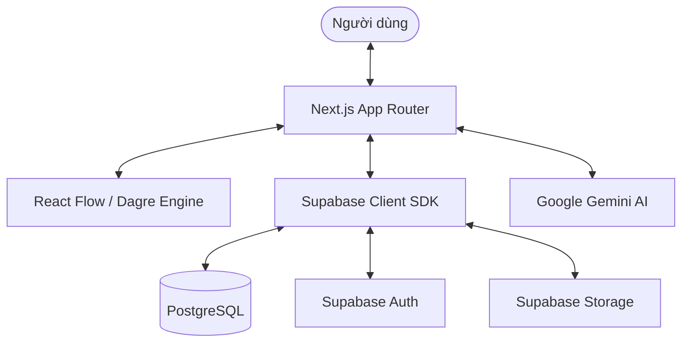

<div align="center">
  

**Nền tảng xây dựng gia phả hiện đại, tương tác và thông minh.**

[](https://nextjs.org/)
[](https://supabase.com/)
[](https://tailwindcss.com/)
[](https://reactflow.dev/)

[Giới thiệu](#-giới-thiệu) • [Tính năng](#-tính-năng-chính) • [Kiến trúc](#-kiến-trúc-tổng-quan) • [Cài đặt](#-cài-đặt)

</div>

---

## 📖 Giới thiệu

**TreeMaker** là một ứng dụng web mã nguồn mở được thiết kế để giúp các cá nhân và gia đình ghi chép, hình ảnh hóa và lưu giữ lịch sử gia đình một cách trực quan nhất. Với sự kết hợp giữa công nghệ đồ họa tiên tiến và trí tuệ nhân tạo, TreeMaker không chỉ là một sơ đồ cây tĩnh mà là một trải nghiệm sống động về cội nguồn.

Dự án được xây dựng với tư duy **Product-First**, tập trung vào trải nghiệm người dùng (UX) mượt mà, tính bảo mật cao và khả năng mở rộng linh hoạt.

## ✨ Tính năng chính

- 🎨 **Canvas Tương tác 2D**: Sử dụng engine mạnh mẽ từ React Flow, cho phép kéo thả, phóng to/thu nhỏ và điều hướng cây gia phả một cách mượt mượt mà.
- 🤖 **AI Assistant**: Tích hợp Google Gemini để phân tích dữ liệu gia đình, gợi ý tiểu sử và giải đáp các thắc mắc về lịch sử dòng tộc.
- 🔒 **Bảo mật RLS**: Toàn bộ dữ liệu được bảo vệ bởi Supabase Row Level Security, đảm bảo chỉ chủ sở hữu cây mới có quyền chỉnh sửa.
- ⚡ **Real-time Collaboration**: Cập nhật dữ liệu ngay lập tức trên mọi thiết bị khi có thay đổi.
- 📱 **Thiết kế Responsive**: Trải nghiệm đồng nhất từ máy tính để bàn đến các thiết bị di động.
- 🌍 **Đa quốc gia**: Hỗ trợ gắn cờ quốc gia, nơi sinh sống cho từng thành viên trong gia đình.
- 🖼️ **Quản lý Media**: Tải lên và tối ưu hóa ảnh đại diện cho các thành viên thông qua Supabase Storage.

## 🏗️ Kiến trúc tổng quan

Dự án áp dụng mô hình **Modern Fullstack** với sự tách biệt rõ ràng giữa logic giao diện và xử lý dữ liệu.



### Stack Công nghệ

- **Frontend**: Next.js 15 (App Router), React 19.
- **Styling**: Tailwind CSS 4, Framer Motion (Animation).
- **Visualization**: React Flow (XYFlow), Dagre (Layouting).
- **Backend/DB**: Supabase (PostgreSQL, Auth, Real-time).
- **State Management**: Zustand.
- **AI**: Google Gemini Pro via AI SDK.

## 🚀 Cài đặt

### Yêu cầu hệ thống

- Node.js 20.x trở lên
- npm / pnpm / yarn
- Tài khoản Supabase và Google AI (để lấy API Key)

### Các bước thực hiện

1. **Clone repository:**

   ```bash
   git clone https://github.com/dexter826/treemaker.git
   cd treemaker
   ```

2. **Cài đặt dependencies:**

   ```bash
   npm install
   ```

3. **Thiết lập cơ sở dữ liệu:**
   - Tạo một dự án mới trên [Supabase](https://supabase.com/).
   - Chạy các script SQL trong thư mục `supabase/migrations` trong SQL Editor của Supabase để khởi tạo schema.

4. **Cấu hình biến môi trường:**
   Tạo file `.env` từ file mẫu:
   ```bash
   cp .env.example .env
   ```
   Sau đó điền các thông tin cần thiết vào file `.env`.

## ⚙️ Env Configuration

Dưới đây là các biến môi trường cần thiết để dự án hoạt động:

| Biến                            | Mô tả                                                |
| ------------------------------- | ---------------------------------------------------- |
| `NEXT_PUBLIC_SUPABASE_URL`      | URL dự án Supabase của bạn.                          |
| `NEXT_PUBLIC_SUPABASE_ANON_KEY` | Public Anon Key từ Supabase.                         |
| `GOOGLE_GENERATIVE_AI_API_KEY`  | API Key của Google Gemini (lấy từ Google AI Studio). |

## 📁 Cấu trúc thư mục

```text
treemaker/
├── .agent/              # Cấu hình và script cho AI Agent trợ giúp dự án
├── app/                 # Next.js App Router (Pages, Layouts, API)
├── components/          # React Components
│   ├── auth/            # Các thành phần liên quan đến đăng nhập/đăng ký
│   ├── tree/            # Logic và giao diện cây gia phả (chính)
│   │   ├── canvas/      # Nodes, Edges, Custom Flow logic
│   │   ├── forms/       # Form thêm/sửa thành viên
│   │   ├── modals/      # Dialog xem chi tiết, cài đặt
│   │   └── parts/       # UI components nhỏ lẻ (Control bar, Search...)
│   └── ui/              # Shadcn UI base components
├── hooks/               # Custom React Hooks
├── lib/                 # Utility functions & Shared configurations
├── supabase/            # Database migrations & Supabase configs
├── types/               # TypeScript type definitions
└── public/              # Static assets (Images, Icons, Fonts)
```

## 🛠️ Chạy project

Chạy môi trường phát triển:

```bash
npm run dev
```

Ứng dụng sẽ khả dụng tại `http://localhost:3000`.

Kiểm tra lỗi và định dạng code:

```bash
npm run lint
```

---

<div align="center">
  Xây dựng bởi <a href="https://github.com/dexter826">dexter826</a> với ❤️ dành cho gia đình.
</div>
